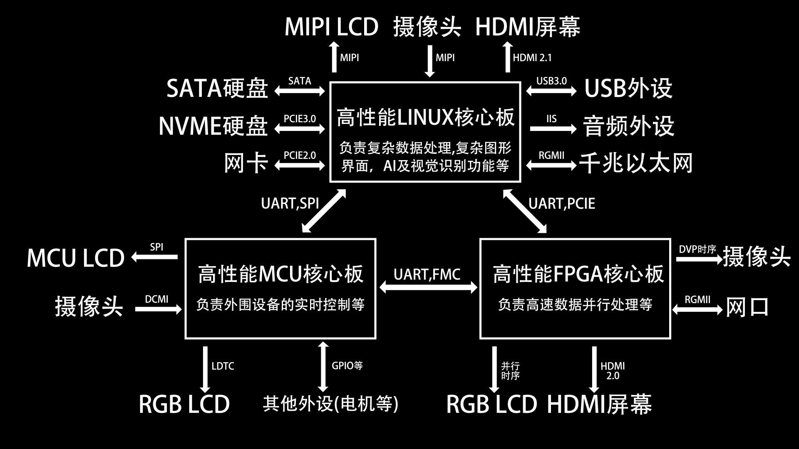

# 高性能嵌入式核心板套件
## 简介
早在2025年3月的时候，我便想自己设计一套高性能嵌入式系统核心板，主要由MCU、LINUX、FPGA三大部分组成。经过一年左右的学习、设计、焊接和调试，终于全部完成了。目前本开源项目包含RK3588核心板、XC7A35T核心板、STM32H750核心板、全志H616核心板四款板卡。其中RK3588核心板的设计和制作极其复杂和艰难，背后有很多的故事。

## 演示视频
RK3588核心板：https://www.bilibili.com/video/BV1JvcFzpEEX  
XC7A35T核心板： https://www.bilibili.com/video/BV11gFkz1Ezn  
STM32H750核心板：https://www.bilibili.com/video/BV1rnFhzgESg  

## 使用方法
### RK3588 文件夹
RK3588核心板套件的项目资料，详情请阅读文件夹内README文档。 

### XC7A35T 文件夹
XC7A35T核心板套件的项目资料，详情请阅读文件夹内README文档。 

### STM32H750 文件夹
STM32H750核心板套件的项目资料，详情请阅读文件夹内README文档。 

### H616 文件夹
H616核心板套件的项目资料，详情请阅读文件夹内README文档。 

## 注意事项
1.仓库内资料仅限个人研究、学习交流等。若需要转载分享仓库内容，请注明原作者"B站：超级像素电子"，禁止用于商业用途

## 主要参考资料
见各核心板项目文件夹内README文档。

