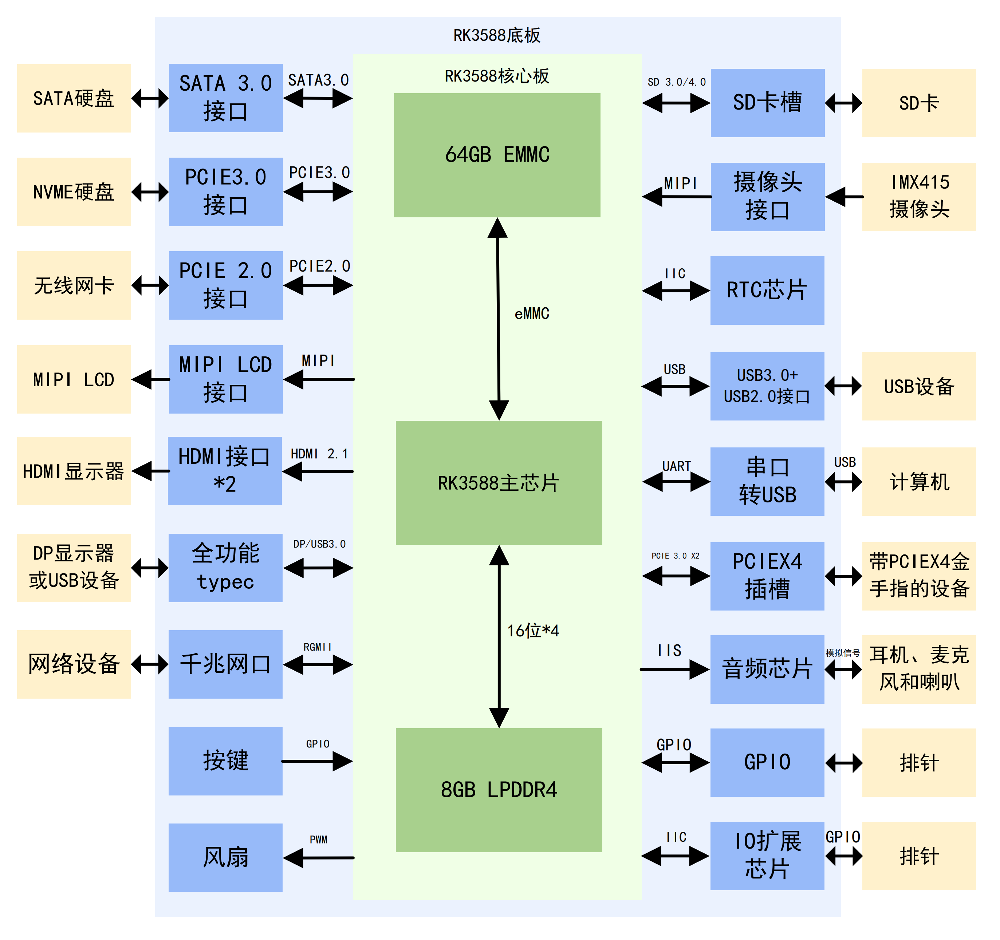

# RK3588核心板
## 简介
这是我参考野火鲁班猫5BTB开发板绘制的RK3588 Linux电脑板卡，核心板性能非常强，有8核高性能CPU，还有GPU，NPU等，还有8GB DDR4运行内存，64GB EMMC存储等。配套底板主要含有PCIE 3.0、HDMI 2.1接口、全功能typec、USB 3.0、SATA、MIPI接口、千兆网口、耳机、喇叭、调试串口、RTC等。

## 演示视频
https://www.bilibili.com/video/BV1JvcFzpEEX  
https://www.xiaohongshu.com/discovery/item/6963a1a3000000001a0259af

## 使用方法
### RK3588核心板 文件夹
RK3588核心板的AD工程，已打板测试，可正常启动，通过串口进入Linux系统。需要在嘉立创使用JLC06161H-3313阻抗来打板。 

### RK3588底板 文件夹
RK3588底板的AD工程，已打板测试。需要在嘉立创使用JLC06161H-3313阻抗来打板。 

测试通过的接口：PCIE 3.0接口(M2 M KEY，连接NVME硬盘)、PCIE 2.0接口(M2 E KEY，连接无线网卡)、MIPI LCD接口、全功能typec接口、千兆网口、风扇、SD卡槽、摄像头接口、RTC芯片、USB3.0接口、USB2.0接口、串口转USB、音频芯片的耳机接口的扬声器、音频芯片的板载喇叭、音频芯片的板载麦克风。 

测试失败的接口： 
1.四个启动相关的按钮中，recovery按钮按下后会进入maskroom模式而不是loader模式。目前原因不明。 
2.HDMI TX0连接不稳定；HDMI TX1测试失败，目前推测可能是因为核心板电源完整性问题引起的。 

未测试的接口：SATA3.0接口、PCIEX4插槽、音频芯片的耳机接口的麦克风、与排针连接的IO扩展芯片的对应引脚和RK3588芯片的对应引脚。

### 5.5寸MIPI屏幕 文件夹
5.5寸MIPI屏幕的AD工程，已打板测试，功能正常。需要在嘉立创使用JLC04161H-3313阻抗来打板。

### IMX415摄像头 文件夹
IMX415摄像头的AD工程，已打板测试，功能正常。需要在嘉立创使用JLC04161H-3313阻抗来打板。

### 外壳 文件夹
存放着外壳亚克力设计文件

### 设备树 文件夹
存放着适配本板卡的设备树文件。 
设备树/rk3588-pixelcard-core.dts：单独核心板运行所需的设备树 
设备树/rk3588-pixelcard.dts：核心板+底板运行所需的设备树 

因为适配板卡系统镜像过大，所以不放在本仓库中。要获得适配板卡的系统镜像，有2个方式： 
方法1.将本设备树搭配鲁班猫的LubanCat_Gen_SDK使用，在SDK里面添加这个设备树并重新编译内核与系统。操作思路详见本项目里的《RK3588调试笔记》1-3。具体方法详见野火鲁班猫官网的《嵌入式Linux镜像构建与部署—基于LubanCat-RK系列板卡》。 
方法2.在鲁班猫成品系统上面直接替换设备树，换成本文件夹里面的设备树(我自己还没有尝试过)。具体方法详见野火鲁班猫官网的《嵌入式Linux镜像构建与部署—基于LubanCat-RK系列板卡》。 

### 其他资料
存放着调试时记录的《RK3588调试笔记》1-3、《RK3588电源调试》、《参考的开源项目汇总》

## 背后的故事
&emsp;&emsp;从2024年1月大二上学期，用树莓派做了很多项目后，我逐渐对树莓派的软件底层和硬件结构产生强烈的好奇，想要自制一个树莓派，不料树莓派的底层软硬件是闭源的，根本就没有办法自制。后来我通过网上搜索的方式知道，树莓派就是一个Linux开发板。在9月份电赛结束之后，我开始了漫长的嵌入式Linux的学习。 
&emsp;&emsp;2024年9月大三上开学的时候，我开始看韦东山的0基础驱动与应用开发视频教程，开始的时候，我学得非常吃力，发现原来是因为我的C语言知识过于薄弱造成的。等到后面补完C语言知识，如函数指针，编译优化和结构体对齐等细节之后，我继续看完了韦东山的基础视频。这时候已经是大三上学期结束，进入寒假了。寒假期间，我照着网上墨云大佬的f1c200s项目开始学习，在原本的基础上，加了一个小键盘，做了一个带全键盘的便携Linux小电脑，在这个项目中，我初步了解了嵌入式Linux的系统移植过程。 
&emsp;&emsp;之后2025年3月大三下的时候，我想要做更复杂的性能更强的Linux板子，并且能够流畅地运行图形化界面，甚至能够运行AI推理，于是我去网上找新的开源项目。我发现网上一个叫柚木鉉的大佬做的全志H616小电脑，它的图形化界面演示视频吸引了我，并且他的硬件资料也是完整的。可是在硬件制作完成之后，我发现软件资料较少，并且没有教程文档。很多东西都需要自己编译，我还碰到了很多报错，问网上大佬并没有得到非常详细的回答，这时候才知道我的Linux基础有非常大的欠缺，于是我决定重新开始学习嵌入式Linux。 
&emsp;&emsp;这时已经是大三下了，保研进入了最后的时期，绩点英语科研竞赛一样都不能落下，还要准备夏令营预推免面试的东西。但是我还是想每天抽点时间来弄一点我自己真正喜欢的东西，我开始阅读琢磨正点原子的Linux开发教程文档，从最基础的cortex-A汇编，C语言裸机，再到uboot源码，Linux内核源码的分析，根文件系统的移植等。断断续续地看了好几个月。在此期间，我被Linux底层原理和处理器底层深深地吸引了，经常看得停不下来。 
&emsp;&emsp;在大三下期间，我也开始了新的自制开发版的芯片选型。我看重了瑞芯微最强的RK3588芯片。这个芯片性能非常强，有8核CPU，还有高性能GPU和NPU等。选完芯片之后，我开始挑选对应的开发板来作为设计参考。首先，我选择了我熟悉的正点原子，买了它家的RK3588开发版，可是等到开发版买来之后，我就发现正点原子不提供3588核心板的原理图，连PDF都没有！慢慢地，通过了解多个商家的开发板，我发现许多商家虽然宣传他们开源了很多资料，可是他们基本上只公开软件资料，而硬件资料的公开程度非常有限。而软件资料通常是跟他们对应的硬件资料强绑定的，必须要购买它们家的板子，他们的开源资料才能得到充分的使用。在失望了很长一段时间之后，我又开始选择新的开发版，这次我选择了野火鲁班猫系列的开发板，他们的鲁班猫资料特别全，从核心板硬件原理图到SDK软件包，再到相关的教程文档都非常全。于是我选择购买了鲁班猫的板卡进行复刻。 
&emsp;&emsp;在2025年9月大四上学期，保研结束之后，我终于有大量时间来继续做这些事情。从保研结束到11月开始，我陆陆续续看完正点原子的Linux驱动开发、应用开发和QT开发，前前后后有3000多页，记了200多页笔记，含有30多页思维导图和几十张代码逻辑剖析图。此时已经是2025年11月，我终于能够正式的进入RK3588的设计。我找来了瑞芯微官方的硬件设计指南，开始详细的研究鲁班猫5的核心板设计，在完全理解核心板设计内容之后，我便开始了我的RK3588核心板的设计，我在保障板子可以启动Linux的前提下，在参考鲁班猫板卡基础上，修改了大量的硬件外设，使得核心板可以不依赖底板，可以单独启动，并符合嘉立创六层免费打板工艺。核心板性能非常强，有8核高性能CPU，还有GPU，NPU等，还有8GB DDR4运行内存，64GB EMMC存储等。配套底板主要含有PCIE 3.0、HDMI 2.1接口、全功能typec、USB 3.0、SATA、MIPI接口等。 
&emsp;&emsp;在绘制过程中，我碰到非常多的问题，我需要在官方硬件设计指南和嘉立创的六层免费打版工艺之间做出合理的权衡，来使得板卡既能运行，又符合嘉立创工艺。其中DDR布线改了三四版，耗时接近一周。核心板画了一个月之后终于画完了，后面两周的焊接调试阶段里，遇到各种各样的电源完整性，虚焊以及Linux内核配置等问题。好在后面通过抓取波形，重新焊接，更换器件和修改设备树等方法，基本解决了问题。在绘制过程中，我记录了非常详细的笔记，便于梳理排查思路，以做出正确的排查方向决策。之后，在2025年12月中旬，核心板终于能够正常的启动Linux系统了！！！接下来是底板的设计和焊接。目前底板已经完成设计，进行了部分元件的焊接，还未上电测试。待全部完成之后大概率会开源完整硬件工程和配套软件SDK配置等。 
&emsp;&emsp;这个工程实在是太复杂了，涉及了非常多硬件底层和软件底层方面的东西，并且这些东西在网上资料是相对较少的，基本上很难获取。更困难的是，周围同学对嵌入式Linux的理解几乎都是在应用方面，他们在基本上都是为了打比赛或做课设等目的，使用树莓派来进行开发，来快速实现功能，而没有去学习了解一些底层的东西。因此我碰到相关问题只能通过咨询网上大佬，很难得到及时详细回复。更多时候需要自己查资料问AI来解决。我终于突破了厂商的闭源资料的限制，克服了复杂的硬件设计、极其精细的焊接工艺、复杂的Linux内核驱动代码等带来的困难，做出了自己的第一套高性能核心板！！非常感谢正点原子详细的学习教程、野火的详细的资料、各位开源大佬的无私奉献和解答，给我了很多思路和灵感。 

## 主要参考资料
1.野火鲁班猫官网 https://doc.embedfire.com/linux/rk356x/quick_start/zh/latest/README.html# 
2.瑞芯微官方的《Rockchip RK3588 硬件设计指南》 
3.《参考的开源项目汇总》内出现的所有开源项目。由于项目过多，此处不一一列举，详情请查看对应文件。

