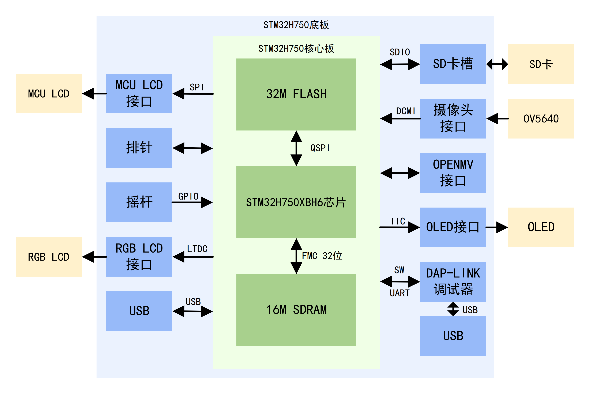

# STM32H750核心板
## 简介
这是我参考反客科技的STM32H750XBH6板子绘制的STM32H750核心板+底板套件，核心板上包含STM32H750XBH6主芯片，外挂32位的16M的大小的SDRAM和32M的FLASH，其余引脚全引出。底板上有摄像头接口、LCD屏幕接口等，还有一个DAP-LINK调试器，只要使用typec线连接电脑，便可以调试程序。

## 演示视频
https://www.bilibili.com/video/BV1rnFhzgESg

## 使用方法
### STM32H750核心板v1 文件夹
第1版核心板的AD工程，已打板测试，此版本的USB部分未经过优化，可能会出现USB无法连接的情况 
晶振"X1"应焊接25M晶振，原理图有误； 电容"C32" "C33"均为6pf，原理图有误 
进行DRC检查的时候会在板对板连接器固定孔处出现DRC报错，可以忽略，不影响正常电气功能
### STM32H750核心板v2 文件夹

第2版核心板的AD工程，此版本的USB部分已经过优化，所有功能测试正常 
晶振"X1"应焊接25M晶振，原理图有误； 电容"C32" "C33"均为6pf，原理图有误 
进行DRC检查的时候会在板对板连接器固定孔处出现DRC报错，可以忽略，不影响正常电气功能

### 底板v1 文件夹
第1版底板的AD工程，已打板测试，此版本的USB部分未经过优化，可能会出现USB无法连接的情况 
进行DRC检查的时候会在板对板连接器固定孔处出现DRC报错，可以忽略，不影响正常电气功能

### 底板v2 文件夹
第2版底板的AD工程，已打板测试，此版本的USB部分已经过优化，所有功能测试正常 
进行DRC检查的时候会在板对板连接器固定孔处出现DRC报错，可以忽略，不影响正常电气功能

### 0.96寸OLED
0.96寸OLED的AD工程，已打板测试，功能正常 
支持IIC、SPI以及并口驱动模式，按照元器件的默认值焊接为IIC驱动模式。其中R14和R15排阻作用是选择顶部IIC排针焊盘的电气连接方向，需要选择一个焊接排阻，另一个不焊接。

### 1.69寸SPI接口彩色液晶
1.69寸SPI接口彩色液晶的AD工程，已打板测试，功能正常 
二极管"D1"的方向画反了，焊接的时候需要按照实际正确方向焊接

### 4.3寸触摸屏
4.3寸触摸屏的AD工程，已打板测试，功能正常 
驱动板支持正点原子排线线序和反客排线线序，具体位置可查看PCB丝印

### ov5640摄像头
ov5640摄像头的AD工程。已打板测试，功能正常 
驱动板支持正点原子排线线序和反客排线线序，具体位置可查看PCB丝印 
二极管"D1"的方向画反了，焊接的时候需要按照实际正确方向焊接

### 外壳
存放着外壳亚克力设计文件

### 测试例程
存放着测试例程代码，主要参考反客科技STM32H750XBH6资料和江协科技OLED程序

### 其他资料
存放着DAP-LINK固件(推荐使用串口烧录)、调试时记录的《STM32H750调试笔记》

## 主要参考资料
1.反客科技STM32H750XBH6板子 https://www.taobao.com/list/dianpu/212360197.htm 
2.江协科技OLED程序 https://jiangxiekeji.com/download.html 
3.正点原子RGB LCD 液晶屏资料 http://47.111.11.73/docs/industry/4-lcd/4.3-RGBLCD-800480.html 
4.正点原子OV5640资料 http://47.111.11.73/docs/industry/6-other/ov5640.html?highlight=ov5640

