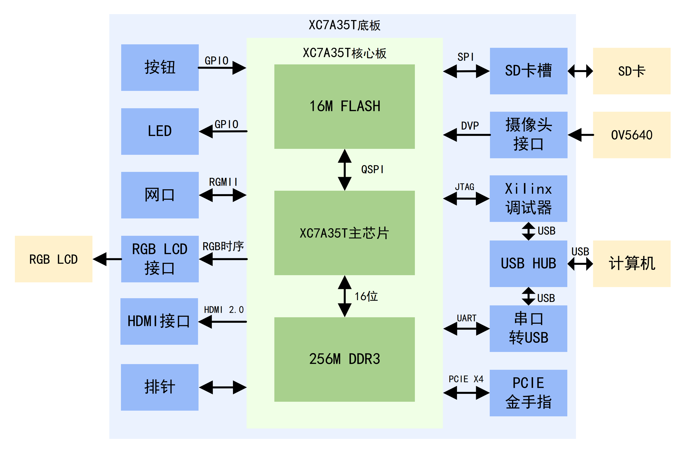

# XC7A35T核心板
## 简介
这是我参考正点原子达芬奇开发板绘制的Xilinx XC7A35T板卡，上面有若干个按钮和LED，还有RGB LCD接口、HDMI接口、网口、SD卡槽、摄像头接口和PCIE金手指接口等外设。还自带Xilinx调试器和两路串口，通过底板自带的USB HUB芯片完成USB信号合并，只需通过一根typec线就可以同时完成供电、FPGA调试和串口收发信息。

## 演示视频
https://www.bilibili.com/video/BV11gFkz1Ezn

## 使用方法
### XC7A35T核心板 文件夹
XC7A35T核心板的AD工程，已打板测试。需要在嘉立创使用JLC06161H-3313阻抗来打板。其中器件U6在 Mechanical1 层上有异常线条，需要手动删除，否则导出Gerber文件时，会出现铜箔短路的问题，导致板子报废无法使用 

### XC7A35T底板v1 文件夹
XC7A35T底板v1的AD工程，已打板测试。需要在嘉立创使用JLC04161H-3313阻抗来打板。按钮、LED，RGBLCD接口、HDMI接口、SD卡槽、摄像头接口测试正常。网口测试失败，可能是网口电路布局布线不合理引起的

### XC7A35T底板v2 文件夹
XC7A35T底板v2的AD工程，此版更换了以太网PHY芯片，并优化了网口电路的布局布线，并增加PCIE金手指接口和12V电源输入接口，已打板测试。需要在嘉立创使用JLC04161H-3313阻抗来打板。按钮、LED，RGBLCD接口、HDMI接口、SD卡槽、摄像头接口测试正常。网口进行MDIO测试时，电脑仅能识别到百兆网，而且FPGA板子上用来指示网口速度的用户LED不亮，可能是网口电路布局布线不合理引起的 
器件D6、D7、D8在 Mechanical1 层上有异常线条，需要手动删除，否则导出Gerber文件时，会出现铜箔短路的问题，导致板子报废无法使用 
电解电容C61画反了，实际焊接的时候需要按照正确方向焊接

### XC7A35T底板v3 文件夹
XC7A35T底板v3的AD工程，此版进一步优化了网口电路的布局布线，已打板测试。需要在嘉立创使用JLC04161H-3313阻抗来打板。按钮、LED，RGBLCD接口、HDMI接口、SD卡槽、摄像头接口测试正常。和之前一样，网口进行MDIO测试时，电脑仅能识别到百兆网，而且FPGA板子上用来指示网口速度的用户LED不亮。目前原因不明。 
电解电容C61画反了，实际焊接的时候需要按照正确方向焊接

### 外壳
存放着外壳亚克力设计文件

### 测试例程
存放着测试例程代码，主要参考正点原子达芬奇FPGA资料。

### 其他资料
存放着xilinx下载器固件、调试时记录的《XC7A35T调试笔记》

### 其他
4.3寸触摸屏和ov5640摄像头的AD工程位于STM32H750开发板的资料底下，请到对应位置查找

## 主要参考资料
1.正点原子达芬奇FPGA开发板资料 http://47.111.11.73/docs/book-videos/zdyzshipin/3fpga/dfq.html 
2.正点原子RGB LCD 液晶屏资料 http://47.111.11.73/docs/industry/4-lcd/4.3-RGBLCD-800480.html 
3.正点原子OV5640资料 http://47.111.11.73/docs/industry/6-other/ov5640.html?highlight=ov5640 
4.给FT232芯片烧录固件作为Xilinx下载器的方法 https://blog.csdn.net/weixin_42741023/article/details/106462147

